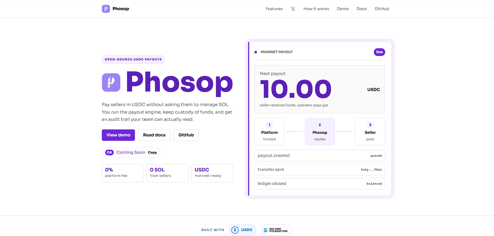
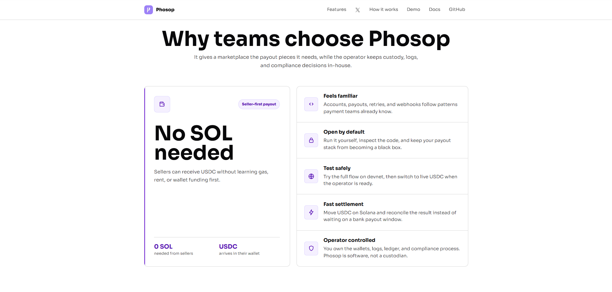
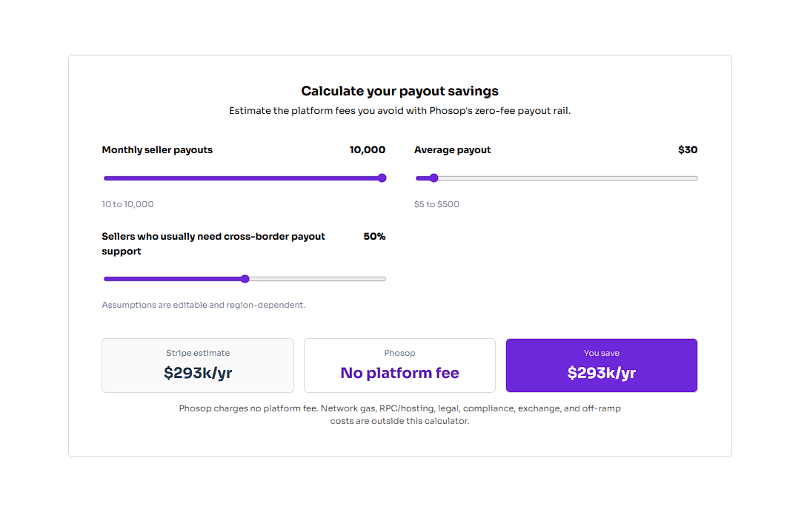

<p align="center">
  
</p>

# Phosop

The open-source payout engine for USDC on Solana.
Pay sellers in USDC without asking them to manage SOL. Gasless for sellers. Self-hosted. Operator-controlled.
Website: https://phosop.fun
Docs: https://phosop.fun/docs

[GitHub](https://github.com/phosop/phosop) | [X / Twitter](https://x.com/yumans21) | [Quickstart](./docs/quickstart.md) | [API Reference](./docs/api-parameters.md) | [Networks](./docs/networks.md) | [Security](./docs/security.md)


<p align="center">
  
</p>

---

Phosop is a free, open-source payout rail for marketplaces that want wallet-native USDC settlement on Solana. It gives you familiar payment primitives - accounts, payouts, idempotency, webhooks, ledger entries, and SDK patterns - while you keep custody of funds and operate the infrastructure yourself.

If you know Stripe-style payout flows, the shape should feel familiar. Create an account, attach a seller wallet, send a payout, and listen for signed webhook events. The difference is that settlement happens in USDC on Solana, and the seller does not need SOL because your fee-payer wallet covers gas and ATA rent.

> Not affiliated with Stripe. "Stripe-compatible" means the API shape is familiar; Phosop does not use or depend on Stripe.
>
> No KYC/AML by design. Phosop is software, not a financial service. Whoever deploys it is the operator and is responsible for custody, key security, sanctions screening, KYC/AML, licensing, tax, and legal compliance.

## Mainnet-ready, devnet-first

Phosop is built so cautious teams can test the full payout flow safely before touching real funds.

0%  
Phosop platform fee

0 SOL  
needed from sellers

USDC  
mainnet-ready payouts

Both devnet and mainnet can run side by side. The API key decides the network, so a test key can never accidentally move real USDC.

| Key | Network | Funds |
| --- | --- | --- |
| `sk_p_test_...` | `devnet` | Fake USDC for safe testing |
| `sk_p_live_...` | `mainnet-beta` | Real USDC |

## Why Phosop?

- **No SOL needed** - Sellers can receive USDC without learning gas, rent, or wallet funding first.
- **Familiar payment patterns** - Accounts, payouts, retries, events, webhooks, and SDK calls follow patterns payment teams already know.
- **Open by default** - Run it yourself, inspect the code, and keep your payout stack from becoming a black box.
- **Safe testing** - Try the full flow on devnet, then switch to live USDC when the operator is ready.
- **Fast settlement** - Move USDC on Solana and reconcile the result instead of waiting on a bank payout window.
- **Operator controlled** - You own the wallets, logs, ledger, and compliance process. Phosop is not a custodian.

<p align="center">
  
</p>

## Phosop vs Stripe Connect

| Capability | Phosop | Stripe Connect |
| --- | --- | --- |
| Platform fee | No Phosop platform fee | Fees vary by region and integration |
| Seller setup | No SOL required from sellers | Bank payout setup varies by country |
| Safe testing | Devnet first, live USDC when ready | Test/live modes with Stripe-managed setup |
| Payout destination | Any attached Solana wallet for USDC | Supported bank/debit payout destinations |
| Payout speed | Solana confirmation plus reconciliation | Bank payout schedule or instant payout rules |
| Ledger | Append-only double-entry ledger | Proprietary reporting and balance transactions |
| Webhooks | HMAC signed, retry, dead-letter alerts | Stripe webhooks |
| Source code | Apache-2.0, self-hostable | Proprietary |
| Compliance | Operator-owned KYC/AML and licensing | Stripe-hosted options available by market |

Stripe pricing and availability are region-dependent. Verify current pricing before quoting exact numbers.

<p align="center">
  
</p>

## Built for

- **Marketplace payouts** - Pay sellers, creators, contractors, or partners in USDC while keeping payout operations in your own stack.
- **Global creator platforms** - Let sellers attach a wallet once and receive USDC when your platform sends a payout.
- **Crypto-native products** - Use wallet-native settlement, signed events, and an auditable ledger without giving up custody.
- **Teams that need safe retries** - Require idempotency on payout endpoints so repeat requests do not accidentally pay twice.

## Migrate in minutes

```typescript
// Before - Stripe-style payout flow
// import Stripe from 'stripe';
// const client = new Stripe('sk_live_...');

// After - Phosop
import { Phosop } from '@phosop/node';

const client = new Phosop('sk_p_test_...', {
  baseUrl: 'http://localhost:3333',
});

// Familiar account object
const account = await client.accounts.create({
  type: 'express',
  country: 'US',
  email: 'seller@example.com',
});

// Attach the seller wallet where USDC should land
await client.accounts.attachWallet(account.id, '<seller_solana_address>');

// Same payout idea, wallet-native settlement
await client.payouts.create({
  amount: '10000000',
  currency: 'usdc',
  destination: account.id,
  idempotencyKey: 'unique-retry-key',
});
```

## Operator dashboard

The included React dashboard gives operators a simple way to check enabled networks, load recent payouts, and preview seller wallet onboarding. The landing site demo expands that into a fuller onboarding and account-home experience.

Sellers connect a Solana wallet once, attach it to their Phosop account, and receive USDC when the operator sends a payout.

## How sellers get paid

1. **Seller attaches a wallet** - Your app creates a seller account, then the seller connects the wallet where they want USDC.
2. **You create a payout** - Choose the seller, amount, and mode. Phosop keeps retries safe and routes the payout to the right network.
3. **USDC lands on-chain** - The platform wallet sends USDC, the fee-payer covers gas, and the ledger records both sides of the movement.

You run the server, fund the platform wallet, fund the fee-payer wallet with SOL, and decide when live payout mode is ready.

## Quick Start

```bash
pnpm install
cp .env.example .env
docker compose up -d mongo
pnpm --filter @phosop/shared build
pnpm --filter @phosop/api dev
```

Open `http://localhost:3333/v1/config` to verify which networks are enabled.

See the full [Quickstart Guide](./docs/quickstart.md) for creating API keys, connected accounts, wallet attachments, and payouts.

## Documentation

Guides and API reference live in [`docs/`](./docs):

- [Quickstart](./docs/quickstart.md) - deploy Phosop and send your first USDC payout
- [Networks](./docs/networks.md) - run devnet, mainnet, or both at once
- [API Reference](./docs/api-parameters.md) - endpoints, parameters, response shapes, and error codes
- [Security](./docs/security.md) - encrypted secrets and self-custodial key handling
- [Ledger](./docs/ledger.md) - double-entry accounting for every confirmed payout
- [Observability](./docs/observability.md) - metrics, structured logs, and alerts

## Supporting Links

- [GitHub repository](https://github.com/phosop/phosop) - source code and releases
- [X / Twitter](https://x.com/yumans21) - project updates
- [Solana Devnet Faucet](https://faucet.solana.com) - fund devnet fee-payer wallets with test SOL
- [Solana Explorer](https://explorer.solana.com) - inspect devnet and mainnet transactions
- [Solscan](https://solscan.io) - inspect payout transaction signatures
- [Solana Wallet Adapter](https://github.com/anza-xyz/wallet-adapter) - wallet connection tooling used by the web app

## Local Development

```bash
pnpm install
docker compose up -d mongo       # MongoDB
pnpm --filter @phosop/api dev    # API on :3333
pnpm --filter @phosop/web dev    # Dashboard on Vite's local port
```

Or run package scripts from the repo root:

```bash
pnpm dev:api
pnpm dev:web
```

### Running Tests

```bash
pnpm test
pnpm lint
```

## Project Structure

```text
phosop/
+-- apps/
|   +-- api/              # NestJS + MongoDB payout engine and REST API
|   +-- web/              # React + Vite dashboard and wallet onboarding
+-- packages/
|   +-- shared/           # Shared TypeScript interfaces and helpers
|   +-- sdk/              # @phosop/node client
|   +-- cli/              # phosop command-line tool
+-- docs/                 # Quickstart, API reference, networks, security, ledger
+-- docker-compose.yml    # MongoDB + API Docker setup
+-- pnpm-workspace.yaml
```

## Contributing

See [CONTRIBUTING.md](./CONTRIBUTING.md) for development setup, style guidelines, and the pull request process.

## Security

See [SECURITY.md](./SECURITY.md) to report vulnerabilities.

## License

[Apache License 2.0](./LICENSE)

---

If Phosop is useful to you, consider giving it a star - it helps others find the project.
